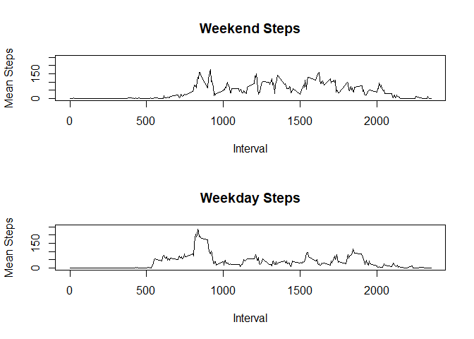

## Loading and preprocessing the data


To load an process the data we will unzip the zip file, and read as a table.


```r
data <- read.table(unz("activity.zip", "activity.csv"), header=T, quote="\"", sep=",", na.strings = "NA")
```


## What is mean total number of steps taken per day?

In order to analyze the daily steps, we need to summarize the steps by day.  Some values are missing, and will be ignored.
We first look at a histogram of the steps each day.  We can see thay the daily steps are highest just over 10,000 steps per day.


```r
stepDaily <- group_by(data, date)  %>% summarize(x=sum(steps)) %>% na.omit()
hist(stepDaily$x, breaks = 20, xlab = "Steps Per Day", ylab = "Daily Occurrences", main = "Dialy Steps Histogram")
```

<!-- -->


```r
stepDailyMean <- as.integer(mean(stepDaily$x, na.rm = TRUE))
stepDailyMedian <- as.integer(median(stepDaily$x, na.rm = TRUE))
```
Looking at the daily activity, we see a mean of 10766 and median of 10765, which is consistent with the hitogram.


## What is the average daily activity pattern?

Daily does not appear to have a consistent pattern.  There seem to be random peaks and valleys during the time period.


```r
plot(stepDaily)
lines(stepDaily, type = "l")
```

<!-- -->


```r
stepInterval <- group_by(data, as.character(interval))  %>% summarize(x=mean(steps, na.rm = TRUE)) 
colnames(stepInterval) <- c("interval","meanSteps")
maxSteps <- stepInterval[which.max(stepInterval$meanSteps),]
```
We see a high average steps of 206.1698113 at 835

## Imputing missing values
We can look at the average steps in the intervals to try and fill in gaps. First we will get the mean number of steps in all interval reguardless of day.  Here you can see the iniial steps of NA can now be replaced with the mean value in finalSteps

```r
data2 <- mutate(data, interval2 = as.character(interval)) # convert interval to string
dataFill <- left_join(data2, stepInterval, by = c("interval2" = "interval"))   # join mean data set
dataFill <- mutate(dataFill, finalSteps = ifelse(is.na(steps), meanSteps, steps))   # new column take mean over NA
head(dataFill)
```

```
##   steps       date interval interval2 meanSteps finalSteps
## 1    NA 2012-10-01        0         0 1.7169811  1.7169811
## 2    NA 2012-10-01        5         5 0.3396226  0.3396226
## 3    NA 2012-10-01       10        10 0.1320755  0.1320755
## 4    NA 2012-10-01       15        15 0.1509434  0.1509434
## 5    NA 2012-10-01       20        20 0.0754717  0.0754717
## 6    NA 2012-10-01       25        25 2.0943396  2.0943396
```

The daily histogram has a similar shape, but a higher peak as additional steps were added to most days.


```r
stepDailyFill <- group_by(dataFill, date)  %>% summarize(x=sum(finalSteps))   # summarize with daily amounts added
hist(stepDailyFill$x, breaks = 20, xlab = "Steps Per Day", ylab = "Daily Occurrences", main = "Dialy Steps Histogram NA Filled With Mean")
```

<!-- -->

## Are there differences in activity patterns between weekdays and weekends?

Looking at the weekend versus weekday, we see a significant peak in the weekdays in the morning, but activity is consitently higher during the weekend.


```r
dataDayOfWeek <- mutate(data, dateObj = as.POSIXct(date)) # convert interval to string
dataDayOfWeek <- mutate(data, isWeekend = is.weekend(as.POSIXct(date))) # convert interval to string
weekendData <- filter(dataDayOfWeek, isWeekend == TRUE)
weekdayData <- filter(dataDayOfWeek, isWeekend == FALSE)
stepIntervalWeekend <- group_by(weekendData, interval)  %>% summarize(x=mean(steps, na.rm = TRUE)) 
stepIntervalWeekday <- group_by(weekdayData, interval)  %>% summarize(x=mean(steps, na.rm = TRUE)) 
colnames(stepIntervalWeekend) <- c("interval","meanSteps")
colnames(stepIntervalWeekday) <- c("interval","meanSteps")
par(mfrow=c(2,1))
plot(stepIntervalWeekend, ylab = "Mean Steps", xlab = "Interval", main = "Weekend Steps", ylim=c(0,250), type = "l")
plot(stepIntervalWeekday, ylab = "Mean Steps", xlab = "Interval", main = "Weekday Steps", ylim=c(0,250), type = "l")
```

<!-- -->


